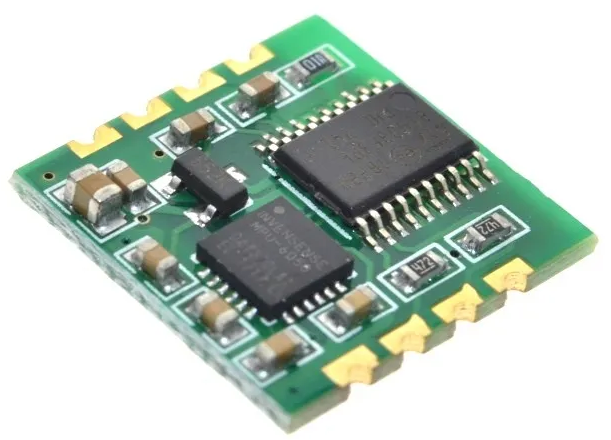

# gy61

Driver for WAVGAT 6 Axis MPU6050 Module with Kalman filtering.




## Preparation

The module comes with I2C and UART interfaces. Only UART interface provides the Kalman-filtered data, so we connect the module to the UART adapter:


## Building

Building with Go compiler `go version go1.21.1 linux/amd64`:

```
cd main/
go build -o gy61
```


## Testing

Run `./gy61` executable, providing the serial device, for example `/dev/ttyUSB0`, in case of USB-UART adapter:

```
./gy61 /dev/ttyUSB0
 -49.12   76.87  107.95
 -48.77   76.82  108.26
 -54.50   -0.64  -53.28
 -54.54   -0.64  -53.28
 -54.56   -0.63  -53.27
 -54.57   -0.63  -53.26
 -54.59   -0.62  -53.22
 -54.60   -0.60  -53.18
 -54.60   -0.59  -53.11
 -54.62   -0.57  -53.03
 -54.60   -0.54  -52.93
 -54.58   -0.53  -52.83
 -54.56   -0.53  -52.74
```

The program will output the 3D data, which will change, as you move the module around.

